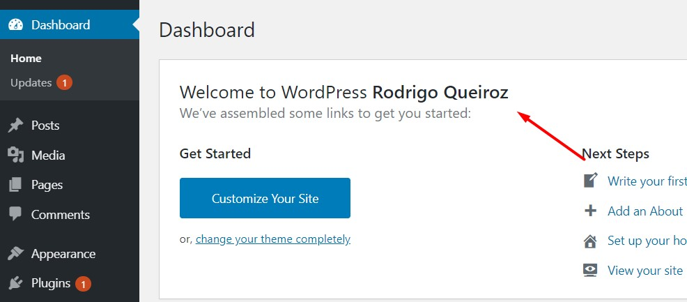

# Welome wordpress plugin

This was my first wordpress plugin. This plugin display your user name in the Wordpress panel section

## Built with

- Wordpress
- PHP
- Javascript
- jQuery

## How to Install

- Click in "Clone or download" button at the top right
- Click in "Download ZIP"
- Go to "yourwebsitefolder/wp-content/plugins/" and unzip there
- On your wordpress admin, go to plugins and activate the "Welcome" plugin
- Enjoy!
